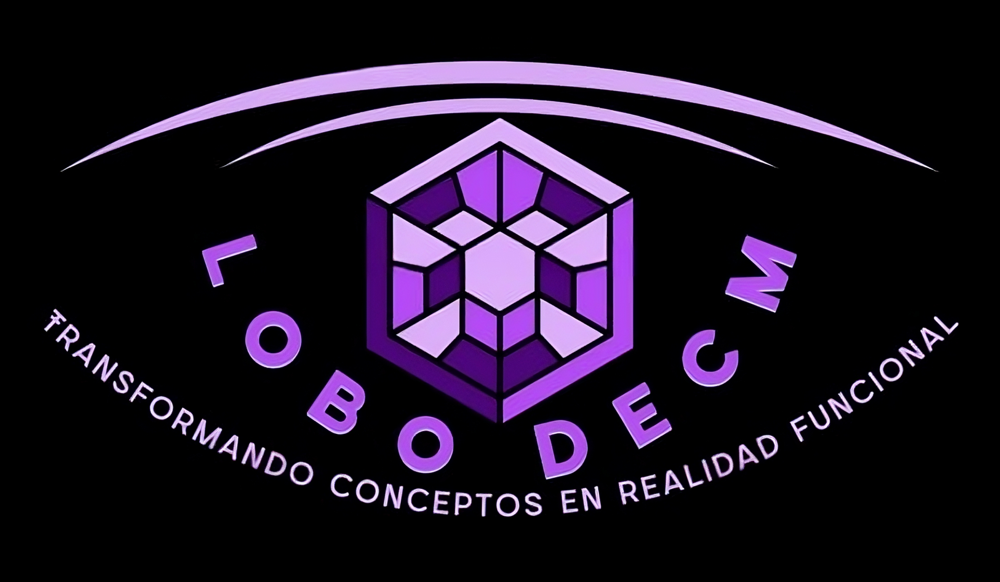

  

<h1 align="center">Hello! I'm David Emmanuel Cerda Martinez 👋</h1>

  Alias: <strong>Lobo decm</strong> | Full-Stack Software Developer 🚀

---

### 💼 About Me
As a software developer, my passion is transforming ideas into robust and scalable web applications. I specialize in full-stack solutions: on the frontend, I'm proficient in JavaScript, React, and Next.js, creating dynamic and responsive interfaces with HTML, CSS, Tailwind CSS, and SASS. On the backend, I build efficient APIs with Node.js and manage SQL and MongoDB databases. Furthermore, I apply agile methodologies like Scrum and Waterfall in my projects, utilizing Git and GitHub for impeccable version control. I'm actively seeking roles where I can design, develop, and deploy innovative products that make a significant impact.

---

### 🛠️ Technologies & Tools

#### 🌐 Frontend

#### ⚙️ Backend

#### 🗃️ Databases

#### 🔧 Tools & DevOps

#### 📋 Methodologies

---

### 📈 GitHub Stats

  
  

  
🔥 Commit Streak

  

    
  

---

### 📫 Click on the button to Contact Me
-   
- 
- 
- 

---

🎯 Courses & Certifications

- Database Course  
- Remote Work Course  
- English Certification B2 Level  

🎮 Hobbies & Interests

- 🏀 Basketball  
- 🎹 Playing Piano  
- 🎧 Listening to Music  
- 🎮 Playing Video Games  
- ♟️ Strategy Games & Boardgames  

---

Thanks for visiting my profile! Hope to connect with you soon 😊
