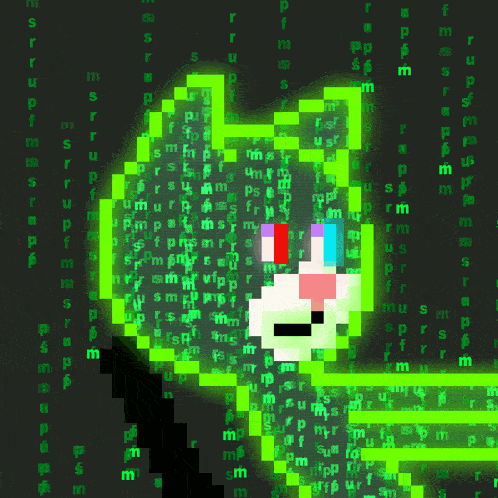

 <h1 align="center">¡Hola! Soy David Emmanuel Cerda Martinez 👋</h1>

  Alias: <strong>Lobo decm</strong> | Software Developer Full-Stack 🚀

---

### 💼 Sobre mí
As a software developer, my passion is transforming ideas into robust and scalable web applications. I specialize in full-stack solutions: on the frontend, I'm proficient in JavaScript, React, and Next.js, creating dynamic and responsive interfaces with HTML, CSS, Tailwind CSS, and SASS. On the backend, I build efficient APIs with Node.js and manage SQL and MongoDB databases. Furthermore, I apply agile methodologies like Scrum and Waterfall in my projects, utilizing Git and GitHub for impeccable version control. I'm actively seeking roles where I can design, develop, and deploy innovative products that make a significant impact.

---

### 🛠️ Tecnologías y herramientas

---

### 📈 Estadísticas de GitHub

  
  

  
🔥 Racha de commits (streak)

  

    
  

---

### 📫 Contáctame
- [GitHub](https://github.com/lobodecm)  
- [LinkedIn](https://linkedin.com/in/david-emmanuel-cerda-martinez-854592251)  
- ✉️ davidmartienz5732891@gmail.com

---

🯠Cursos y certificaciones

- Curso de bases de datos  
- Curso de trabajo remoto  
- Certificación de inglés nivel B2  

🮠Hobbies y pasatiempos

- 🏀 Basketball  
- 🎹 Tocar el piano  
- 🎧 Escuchar música  
- 🎮 Jugar videojuegos  
- ♟️ Juegos de estrategia y boardgames  

---

¡Gracias por visitar mi perfil! Espero conectar contigo pronto 😊
